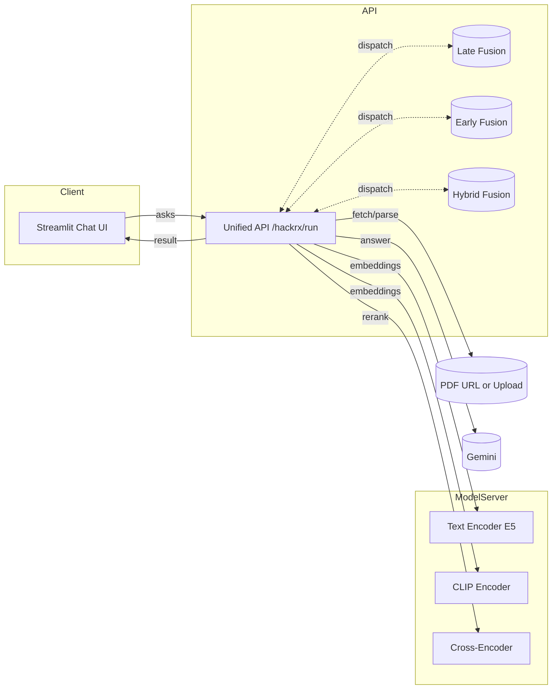
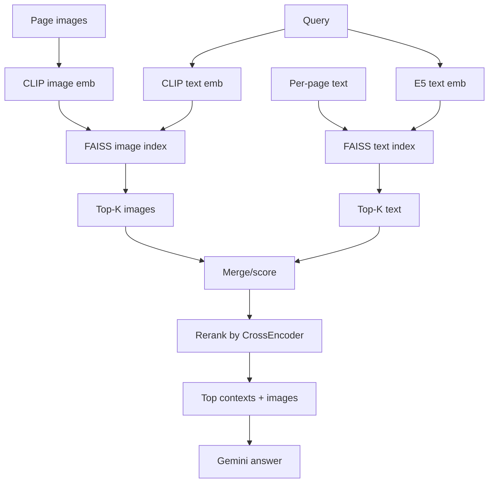
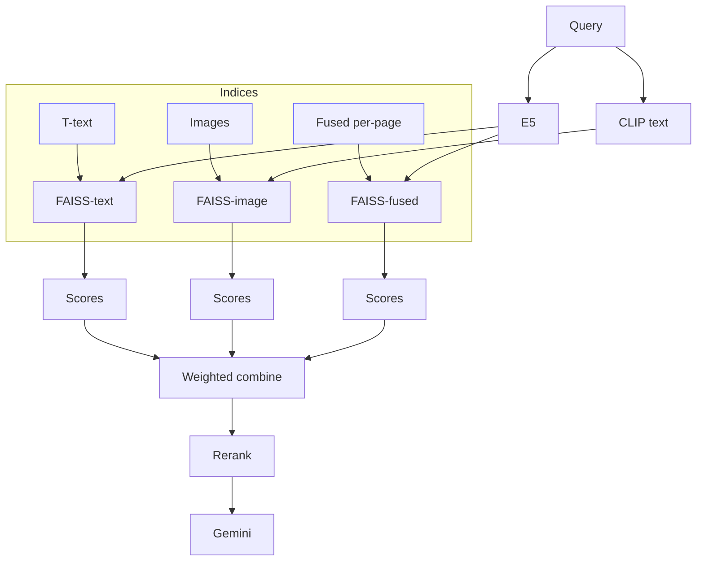

<div align="center">

# Fusion QA: Early, Late, and Hybrid Retrieval with Gemini + GPU

Multi-modal, GPU-accelerated question answering over PDFs with three fusion strategies, a unified API, and a Streamlit chat UI.

</div>

## Highlights

- Multi-modal retrieval: text (E5) + images (CLIP) with optional OCR
- Three fusion modes: Late, Early, Hybrid (unified dispatcher on one endpoint)
- GPU acceleration: CUDA-backed embeddings and reranking, optional FAISS GPU
- Answer generation with Gemini; robust retry/backoff and fallback model
- Streamlit chat UI with URL/upload, image previews, health badges, and presets
- Evaluation harness with EM/Precision/Recall/F1, BLEU-1, ROUGE-L, and numeric-aware metrics

## Tech stack

- Backend: FastAPI (Python)
- Models: Sentence-Transformers (E5 text, CLIP ViT-L-14 text+image), CrossEncoder (MS MARCO)
- Vector search: FAISS (L2-normalized cosine/IP; optional GPU)
- LLM: Google Gemini (default `gemini-2.0-flash-exp`; configurable)
- PDF/image: PyMuPDF (fitz), PIL; optional Tesseract OCR
- UI: Streamlit
- Infra: Windows + PowerShell scripts, .env config

## Architecture (end-to-end)



## Fusion modes explained

### Late Fusion

Separate retrieval pipelines per modality, then merge and rerank.



Key points:
- Text chunks and image candidates are retrieved independently and merged by score.
- Reranking improves grounding; selected images are passed to Gemini alongside text.

### Early Fusion

Create a single per-page fused vector of text + average image embeddings.

```mermaid
flowchart TB
    P[Page] --> TXT[E5 text emb]
    P --> IMG[Avg CLIP image emb]
    TXT --> F[[Fused vector [w_t*txt ; w_i*img]]]
    IMG --> F
    F --> FIDX[FAISS fused index]
    Q[Query] --> QTXT[E5 text emb]
    QTXT --> QF[[Query fused vector]]
    QF --> FIDX
    FIDX --> TK[Top-K pages]
    TK --> RR[Rerank]
    RR --> Ctx[Contexts + images]
    Ctx --> A[Gemini answer]
```

Key points:
- Single retrieval pass over fused vectors; balances modalities via weights.
- Good default for mixed text+visual documents.

### Hybrid Fusion

Blend scores from text, image, and fused indices with weights, then rerank.



Key points:
- Retrieves from all three views; weights are tunable via env vars.
- Often most robust across diverse document layouts.

## Repository layout

- `main_api.py` — unified FastAPI app: `/hackrx/run`, `/hackrx/fusions`, `/hackrx/health`
- `main_latefusion.py` — late-fusion implementation and route
- `main_earlyfusion.py` — early-fusion implementation and route
- `main_hybridfusion.py` — hybrid-fusion implementation and route
- `model_server.py` — embedding/reranking service (E5, CLIP ViT-L-14, CrossEncoder)
- `utils.py` — model server clients, Gemini generator with retries/fallback
- `app.py` — Streamlit chat UI (URL/upload, presets, image previews, health)
- `evaluate_all_fusions.py` — benchmark metrics (EM/P/R/F1, BLEU-1, ROUGE-L, numeric)
- `test_*.py` — quick tests and latency comparisons
- `start_unified.ps1` — one-click startup for model server, unified API, and UI
- `_lf_cache/` — per-run cache of extracted images to avoid Windows file locks

## Requirements

- Python 3.10+
- Windows 10/11 (PowerShell) or other OS with minor adjustments
- Optional CUDA GPU (NVIDIA) for best performance
- Google Gemini API key

## Setup (Windows PowerShell)

1) Create and activate a virtualenv

2) Install dependencies (torch build should match your CUDA)

3) Create `.env` with your keys and settings

4) Start everything with `start_unified.ps1`

Notes:
- The startup script frees ports 8000/8001, starts the model server (8001), unified API (8000), and Streamlit UI (8501).
- If you prefer, there is a VS Code Task “Start Streamlit dashboard” to run the UI only.

## Configuration (.env)

LLM/Gemini:
- `GEMINI_API_KEY` — your API key
- `GEMINI_MODEL` — e.g. `gemini-2.0-flash-exp`, `gemini-1.5-flash`
- `GEMINI_FALLBACK_MODEL` — optional fallback when 429 quota hit
- `GEMINI_INCLUDE_IMAGES` — `true|false`: pass images to Gemini
- `GEMINI_MAX_RETRIES` — retry attempts on 429 (default 3)
- `GEMINI_BACKOFF_BASE` — seconds for exponential backoff (default 5.0)

Model server and retrieval:
- `MODEL_DEVICE` — `cuda` or `cpu`
- `MODEL_DEVICE_ID` — CUDA device index (default 0)
- `TEXT_EMB_MODEL_NAME` — default `intfloat/e5-base`
- `CLIP_MODEL_NAME` — default `clip-ViT-L-14`
- `CROSS_ENCODER_MODEL` — default `cross-encoder/ms-marco-MiniLM-L-6-v2`
- `FAISS_USE_GPU` — `true|false` (optional acceleration)

Retrieval knobs (examples; may be set per fusion file):
- `K_TEXT`, `K_IMAGE`, `K_FUSED` — candidate counts
- Early fusion weights: `FUSION_TEXT_WEIGHT`, `FUSION_IMAGE_WEIGHT`
- Hybrid weights: `HYBRID_W_TEXT`, `HYBRID_W_IMAGE`, `HYBRID_W_FUSED`

## Starting services

- Preferred: run `start_unified.ps1` to launch all three (model server, API, UI)
- Manual alternative:
  - `uvicorn model_server:app --host 127.0.0.1 --port 8001`
  - `uvicorn main_api:app --host 127.0.0.1 --port 8000`
  - `streamlit run app.py --server.port 8501`

Health checks:
- Unified: GET `http://localhost:8000/hackrx/health` (includes model server device)
- Model server: GET `http://localhost:8001/health`

## API usage

Unified endpoint (recommended):
- POST `http://localhost:8000/hackrx/run`
- Body:
  - `documents`: PDF URL or local path
  - `questions`: list of questions
  - `fusion`: `late` | `early` | `hybrid`

Discovery:
- GET `http://localhost:8000/hackrx/fusions` — lists available fusion modes

Individual routes (only if corresponding apps are running directly):
- Late: POST `/hackrx/run_latefusion`
- Early: POST `/hackrx/run_earlyfusion`
- Hybrid: POST `/hackrx/run_hybridfusion`

Response shape (unified):
- `{ "answers": [str, ...], "debug": { ... } }`

## Streamlit UI

- Open http://localhost:8501
- Choose document source (URL or upload), select fusion mode, and ask questions in chat.
- UI shows health badges, image previews used in answers, and debug details.

## Evaluation and benchmarking

- Run `evaluate_all_fusions.py` to benchmark Late, Early, and Hybrid on a fixed question set.
- Metrics reported per mode:
  - Exact Match, Precision, Recall, F1
  - BLEU-1, ROUGE-L
  - Numeric-aware: match rate, average absolute/relative error (extracts first number, handles %, currency)
- Results saved to `fusion_benchmark_results.json` with per-question details and summary latency.

Tips:
- Tune hybrid weights (e.g., `HYBRID_W_IMAGE`, `HYBRID_W_TEXT`, `HYBRID_W_FUSED`) to favor image-heavy vs text-heavy documents.
- If you hit Gemini 429 (quota), set `GEMINI_FALLBACK_MODEL` or re-run after quota reset; retries/backoff are built-in.

## Troubleshooting

- Gemini 429 / quota: the code retries with exponential backoff; configure `GEMINI_FALLBACK_MODEL` to continue seamlessly.
- Wrong Gemini model: set `GEMINI_MODEL` to a supported name (e.g., `gemini-1.5-flash`).
- CUDA not available: the model server will fall back to CPU automatically; set `MODEL_DEVICE=cpu` to force.
- Windows file locks on images: images are saved into unique per-run cache folders under `_lf_cache/` to avoid conflicts.
- OCR not installed: install Tesseract (Windows builds available on the UB-Mannheim wiki) and set OCR flags in env if applicable.

## Performance tuning

- Enable GPU: `MODEL_DEVICE=cuda` and optionally `FAISS_USE_GPU=true`.
- Reduce candidate K for speed: `K_TEXT`, `K_IMAGE`, `K_FUSED`.
- Prefer Gemini Flash variants for latency.
- Disable OCR when not needed.

## Security

- Do not commit `.env` or API keys.
- The system does not upload documents externally; images sent to Gemini are loaded from local cache as PIL objects (no remote RAG store).

## Notes for contributors

- Keep public APIs stable; add tests when changing retrieval or fusion logic.
- When adjusting weights or K values, reflect defaults in README and `.env.example` (if present).
- The Streamlit UI is intentionally light; feel free to extend with metrics panels or charts.

---

Copyright © 2025
